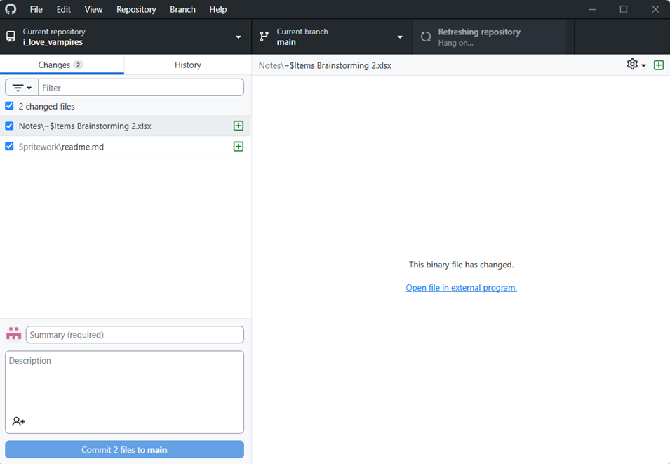

Hello art person, here's where you can drop off all of your sprites.
If you've used GitHub before, you can just skip this next part.

## How to use GitHub
Github is a file storage website aimed at programmers. Each project is represented by a GitHub repository. The repository for this game is called "i_love_vampires".
When downloading files from a repository, you can download them individually in your browser with no strings attached. However, uploading is a lot more complicated.    

GitHub uses "version control", which means that any of the changes people make to the stored files are documented with extreme detail and saved forever. That way, if anyone
accidentally breaks something, you can easily restore a working version. You can also use it to track what you've worked on over time.    

So how do you upload new files to this folder?  
1. Download and open GitHub Desktop
2. Click file->Clone Repository
3. In the entry field "URL or username/repository" paste this: "https://github.com/NauPhy/i_love_vampires.git"
4. Choose a convenient path- this is going to copy the entire filesystem from GitHub
5. Click clone
6. Once it is done cloning, you can navigate to the filepath on your computer and copy/paste files normally there.
7. When you want to upload your changes, go back to GitHub Desktop, make sure you're in the right repository. It should look something like this, with your new changes
on the left.

8. In order to Upload, Github requires a summary. You can do that or just keyboard mash. Then click "Commit X files to main".
9. After you create a new commit, the button that said "Fetch origin" in the upper right should now say "Push origin". Click that and you're done!

## Alternative: Google Drive
Google Drive is a bit more intuitive and doesn't rquire you to download software or copy the repository to your computer. I don't have a Google Drive set up, but
if that would be better for you I can do that instead.

## Sprite Organization
As of the creation of this document, the only sprites I have requested are sprites for attack effects, such as projectiles, sword slashes, explosions, AOE sigils, etc.
Since this is only a subset of the sprites that will be needed for the game, I gave them their own subfolder.  

Now you may have noticed that I specified attack effects rather than weapons. If you've played a survivors game before you'll know that weapons usually are not shown,
just the attacks they create. Because most weapons have exactly 1 attack effect, the folders are organized by weapon rather than attack. If you think an attack sprite would
work for more than one weapon, you can use the same sprite for both, but generally it should at least have a filter over it or a palette swap to make it slightly different.  

The weapons are further organized into sets, which are both a thematic and gameplay grouping. This is fairly common in survivors games, but often the set won't be formally
aknowledged. In this game the sets are quite distinct, and each set has a couple of "ultimate" weapons or passives that need to be unlocked via meta progression. 
This system is very similar to the one used Nova Drift, though the ultimate items (super mods) in Nova Drift are independent from any sets.  

I'm considering giving each set its own version of a few generic attacks. For example, "fireball" could have an "ice ball" version and a "shadow ball" version from ice and dark sets.
They may have somewhat different pierce/size/speed/damage/attack speed, and of course status effects.
This would allow sprite reuse via pallete swaps and would require fewer ideas from me (thinking is hard). Possibly a bit lazy, but it's exactly what Soulstone Survivors did and I think
it worked incredibly well for them.  

For the first round of sprite work I'm requesting, I'll only list sprites for the "Light" and "Dark" sets, which are inspired by Kayle and Morgana. Other examples of sets include:
- Fire
- Explosive
- Blood
- Silver
So in other words not too different from sets in other games like Teamfight Tactics, Megaloot, etc.  

Each weapon will explicitly state what sprite it needs for its attack effect, with at least a basic description. There will also be at least a basic description of the 
weapon in general for inspiration; for example a sniper rifle may have a very high projectile velocity, which would lend itself well to a long, thin projectile sprite.  

## Perspective
The game is 100% top down. Using an angle would make the physics more difficult, but it would also probably require multiple sprites for every attack.

If you have any questions or ideas, let me know!